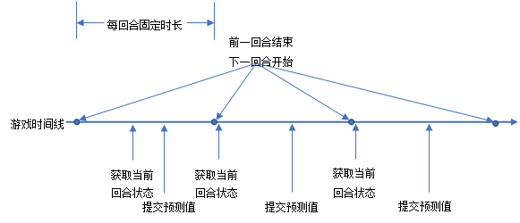

# 这是什么项目？
这是一个可以与“黄金点”游戏服务器交互的示例客户端程序，使用 C# + [WPF](https://docs.microsoft.com/en-us/dotnet/framework/wpf/) 实现。
这个客户端提供了基本的游戏功能，比如控制游戏的进程、提交黄金点、查看历史提交数据、游戏房间管理等。

效果如下图：

# 什么是“黄金点”游戏？
请在邹欣老师的博客查看游戏介绍：[创新的时机 – 黄金点游戏](https://blog.csdn.net/SoftwareTeacher/article/details/25794525)

## 我们采用的游戏规则
N个玩家，每人写一个或两个0~100之间的有理数 (不包括0或100)，提交给服务器，服务器在当前回合结束时算出所有数字的平均值，然后乘以0.618（所谓黄金分割常数），得到G值。提交的数字最靠近G（取绝对值）的玩家得到N分，离G最远的玩家得到－2分，其他玩家得0分。只有一个玩家参与时不得分。

# 我们需要哪些预备知识来阅读这些代码？
为了阅读这部分代码，我们需要：
- 对 C# 编程语言有基本的了解；
- 对 C# 的 `async/await` 编程模式有基本的了解。

同时，这些知识能更好地帮助理解这些代码：
- 对多线程操作的基本认识；
- 对 `Task`-based 异步操作的理解。
- 对 WPF 和 XAML 的了解。

# 如何让这个项目在机器上跑起来呢？
为此，我们需要：
- Windows 操作系统；
- Visual Studio 2017（推荐[免费的 Community 版本](https://visualstudio.microsoft.com/zh-hans/vs/community/)），并安装 ***.NET桌面开发*** 工作负载。

# 配套的服务器接口介绍
下图描述了服务器如何驱动游戏一回合接着一回合的运转，同时指出了AI或客户端应何时与服务器交互。

当AI或客户端进入游戏后，应立即向服务器请求获取当前回合的状态，此时可以知道服务器上正在进行的游戏回合的编号，以及本回合还有多长时间结束。AI或客户端可以按照返回的回合编号向服务器提交预测值，并且可以根据本回合剩余时间，设定一个定时器，在下一回合开始时，再次执行获取回合状态的接口，来取得下一回合的状态。这样依次轮转下去，AI或客户端就可以一直参与在游戏中。
同时，AI或客户端还可以在每回合开始时，调用获取历史数据的接口，来得到前几回合的比赛数据。这样可以知道自己在上一回合是否得分胜出，并可以根据历史数据来指导当前回合的预测值。

## 接口概述

服务器地址：https://goldennumber.azurewebsites.net

所有请求需要的参数都拼装在URL中，并且需要对值进行URL编码。

所有请求的响应报文内容都是JSON格式

**成功的响应报文至少包含下面两个属性：**

属性名 | 数据类型 | 备注
-|-|-
roundId | String | 当前房间内正在进行的游戏回合编号
leftTime | Int | 当前游戏回合还有多少秒截止提交预测值

如果服务器响应代码不是2\*\*或3\*\*，表示该次请求失败。

**失败的响应报文至少包含下面一个属性：**

属性名 | 数据类型 | 备注
-|-|-
message | String | 出错的具体信息

## 获取状态

请求方式：GET

路径：/api/State

客户端使用该接口可以获取当前房间内的游戏状态，可以根据当前游戏支持提交的预测值的个数进行提交。同时还可以知道当前回合什么时间结束，推算出什么时候可以取得本回合的比赛数据以及获取下一轮比赛的相关信息。

请求需要用到的参数：

参数名 | 数据类型 | 是否必需 | 备注
-|-|-|-
uid | String | 可选 | 用户编号，需要是GUID的格式 如果此参数为空，服务器会分配一个用户编号并返回
roomid | Int | 可选 | 房间编号 如果此参数为空，默认0号房间

响应报文内容中的属性：

属性名 | 数据类型 | 备注
-|-|-
userId | String | 用户编号
nickName | String | 用户昵称
roomId | Int | 房间编号
numbers | Int | 当前房间内的游戏支持提交的预测值的个数，1或2
roundEndTime | datetime | 当前回合截止提交的UTC时间

## 提交预测值

请求方式：POST

路径：/api/Submit

客户端使用该接口可以向服务器提交预测值。每回合只允许提交一次，提交成功后不可修改。

请求需要用到的参数：

参数名 | 数据类型 | 是否必需 | 备注
-|-|-|-
rid | String | 必需 | 要提交预测值的回合编号，需要是GUID的格式
n1 | Double | 必需 | 预测值，必须是0到100之间的有理数，不包括0和100
n2 | Double | 可选项 | 第二个预测值，如果当前游戏是支持两个数的游戏，此参数也为必需项；如果当前游戏仅支持一个数，此参数将被忽略

## 获取历史数据

请求方式：GET

路径：/api/History

使用该接口可以获取当前房间内的历史数据，包括每回合的黄金点、每个玩家的预测值、得分等信息。

没有指定任何参数时，返回0号房间内最新的10回合的历史。

请求需要用到的参数：

参数名 | 数据类型 | 是否必需 | 备注
-|-|-|-
roomid | String | 可选项 | 房间编号 如果该参数为空，默认0号房间
startrid | String | 可选项 | 开始查询的游戏回合编号 如果该参数为空，默认为当前正在进行的回合
count | Int | 可选项 | 指定从startrid开始返回多少回合的历史，不包括startrid回合 如果没有指定该参数，默认为10，最大不超过100
direction | Int | 可选项 | 查询的方向 默认值是0，表示从startrid查询旧的历史数据 另一个值是1，表示从startrid查询更新数据

响应报文内容中的属性：

属性名 | 数据类型 | 备注
-|-|-
rounds | Array | 查询到的回合的数组，数组的每个元素包含以下属性： roundId, time, goldenNumber, userNumbers
&nbsp;&nbsp;&nbsp;&nbsp;roundId | String | 回合编号
&nbsp;&nbsp;&nbsp;&nbsp;time | String | 该回合的截止时间，UTC
&nbsp;&nbsp;&nbsp;&nbsp;goldenNumber | Double | 该回合的黄金点
&nbsp;&nbsp;&nbsp;&nbsp;userNumbers | Array | 该回合所有玩家提交的数的数组，数组的每个元素所含以下属性： userId, masterNumber, slaveNumber, score
&nbsp;&nbsp;&nbsp;&nbsp;&nbsp;&nbsp;&nbsp;&nbsp;userId | String | 用户编号  
&nbsp;&nbsp;&nbsp;&nbsp;&nbsp;&nbsp;&nbsp;&nbsp;masterNumber | double | 用户提交的第一个预测值
&nbsp;&nbsp;&nbsp;&nbsp;&nbsp;&nbsp;&nbsp;&nbsp;slaveNumber | double | 用户提交的第二个预测值，仅当当前游戏支持提交两个数的时候有效
&nbsp;&nbsp;&nbsp;&nbsp;&nbsp;&nbsp;&nbsp;&nbsp;score | Int | 用户在当前回合的得分
nickNames | object | 用户编号和用户昵称的字典 用户编号是key，用户昵称是value

## 设置用户昵称

请求方式：POST

路径：/api/NickName

使用该接口可以用来设置用户的昵称，昵称相对于编号来说，有更佳的辩识度。

请求需要用到的参数：

参数名 | 数据类型 | 是否必需 | 备注
uid | String | 必需 | 用户编号 
nickname | String | 必需 | 用户昵称

## 获取新游戏房间

请求方式：GET

路径：/api/NewRoom

使用该接口可以获取当前房间内的游戏状态，可以根据当前游戏支持提交的预测值的个数进行提交。同时还可以知道当前回合什么时间结束，推算出什么时候可以取得本回合的比赛数据以及获取下一轮比赛的相关信息。

请求需要用到的参数：

参数名 | 数据类型 | 是否必需 | 备注
-|-|-|-
role | int | 可选项 | 设置房间支持的角色，不同角色的房间在交互方式、体验上不同 默认是0，表示玩家可以手动提交数据参与的房间
numbers | Int | 可选项 | 设置游戏支持的每个玩家可以提交的预测值 的个数 默认是1，表示每个玩家可以提交一个数
duration | Int | 可选项 | 设置游戏中每回合的间隔时间 默认值是60秒，取值范围在10~200之间

响应报文内容中的属性：

属性名 | 数据类型 | 备注
-|-|-
roomId | Int | 游戏房间编号
